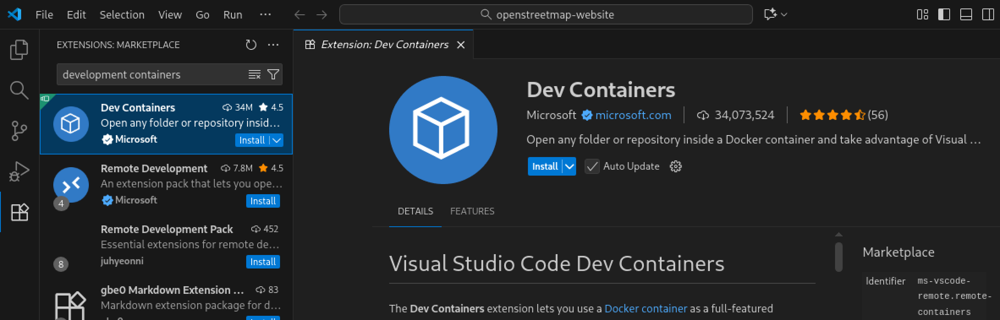
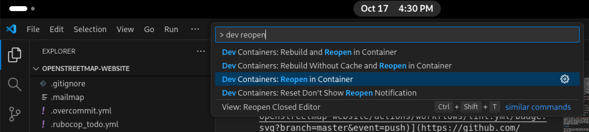
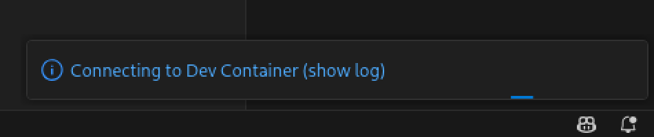
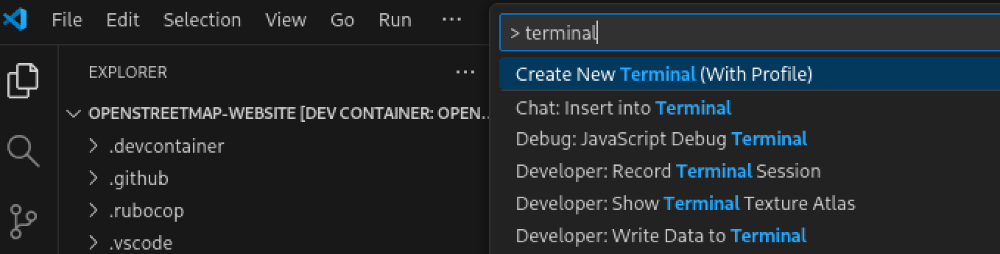
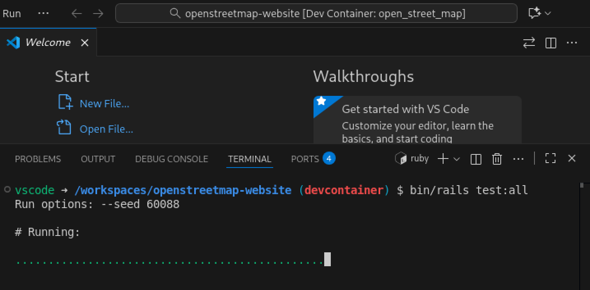
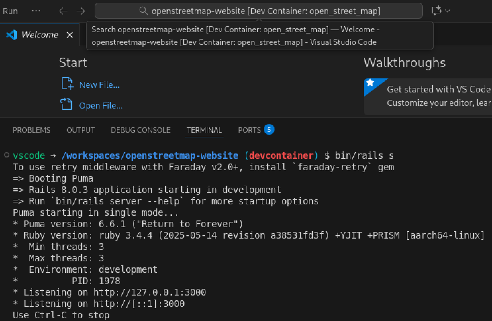

# Using Development Containers for development and testing

You can set up a development environment for this project using [Development Containers](https://containers.dev/), aka. devcontainers.

There are different ways of working with devcontainers, some are automated and integrated in IDE applications, while others are more manual and require CLI tools. This guide will use [Visual Studio Code](https://code.visualstudio.com) and assumes that it's installed already.

## Install Git and Docker

You will need Git to work with the code repository, and Docker to run the devcontainer. Depending on your Operating System, the process will be different. See [DOCKER.md](DOCKER.md) for installation instructions.

**TODO: instructions to install Git.**
**TODO: clone the repo.**
**TODO: do we need to explain that the user needs permission to run Docker? On Debian/Ubuntu, by getting added to the `docker` group.**

## Install Dev Containers extension

Start by opening the project with VS Code. Within it, you will need to install the extension _Dev Containers_, which can be done from the _Extensions_ section, reachable via the sidebar icons. Or VS Code may show a popup recommending this extension, with a button to install it directly.

## Open the project in a container

If everything is correct, this should make a few new commands available to you within VS Code. Find and run the command "Dev Containers: Reopen in Container".

The first time you do this, it will go into a bit of a process. It will create the devcontainer, pull the Docker images, install the dependencies, etc. Go drink some water while this runs.

Eventually this will present you with a development environment ready to go. In subsequent occasions this should be much faster.

## Done!

If everything went well, you are done! For example, now you can open a shell in this environment using the VS Studio command "Create New Terminal (With Profile)":

From this terminal, you can run the test suite with `bin/rails test:all`:

Hopefully it should be all green? 🤞 You can also start a development server with `bin/rails s`:

It will take a moment to start, after which you will be able to take a browser to http://localhost:3000 and visit your own local version of the site.

## Other tools

VS Code is not the only way to work with devcontainers. Other options include:

- [RubyMine](https://www.jetbrains.com/help/ruby/start-dev-container-inside-ide.html): another popular environment to work with Ruby.
- [DevPod](https://devpod.sh): a CLI tool to work with devcontainers.
